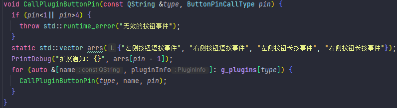
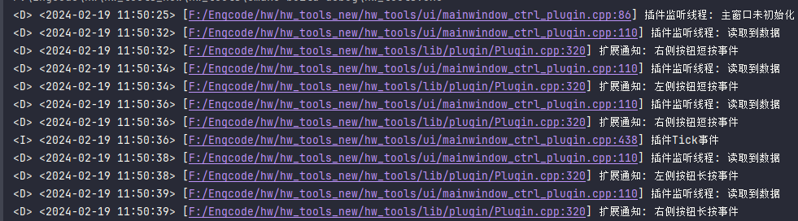

# 插件接口

## 被动接口

> 上位机调用插件

### PluginRegister() char*

> 插件第一次注册时会调用这个接口,需要构造一串C风格JSON文本还给上位机.  
> 无需管理内存问题,上位机会自己释放.

#### 示例

```json
{
  "name": "插件名称",
  "version": "插件版本",
  "author": "作者",
  "description": "插件说明"
}
```

---

### PluginUnRegister() bool

> 插件卸载时会调用这个接口,返回bool类型

---

### PluginInit(char*)

> 插件第一次初始化会调用,整个生命周期内也只会调用一次,传入一个json字符串

#### 示例

```json
{
  "enable": true,
  // 是否启用
  "name": "插件名称",
  "version": "插件版本",
  "author": "作者",
  "description": "插件说明",
  "raw_name": "标示名称",
  "plugin_path": "插件的目录,创建的文件不应超出此目录,请规范使用参数",
  "calls": [
    // 主动方法,例如主动推送墨水屏图片等
    {
      "name": "主动方法名称",
      "address": "主动方法地址"
    }
  ]
}
```

### PluginConfigUI() char*

> 上位机请求配置页面数据

#### 示例

```json
{
  "widgets": [
    // 一个widgets一行
    [
      {
        "Type": "text",
        // 组件类型
        "Text": "和风天气秘钥",
        // 标题/文本内容
        "Layout": 2
        // 布局百分比,2代表20%
      },
      {
        "Type": "input",
        "Bind": "weather_key",
        // 绑定数据,后续接口使用,同一个插件内不要有重复bind
        "Text": "xxxx",
        "Layout": 8
        // 布局百分比,80%
      }
    ],
    [
      {
        "Type": "checkbox",
        "Text": "付费接口(免费订阅秘钥不能勾选)",
        "Bind": "weather_api_business",
        "Layout": 5
      }
    ]
  ]
}
```

#### 组件Type说明

| 类型       | 注释    |
|----------|-------|
| text     | 标签    |
| input    | 输入框   |
| input_ml | 多行输入框 |
| checkbox | 多选框   |
| divider  | 分隔条   |
| submit   | 提交按钮  |

---

### PluginSaveConfig(char*) bool

> 插件页面会有一个保存配置按钮,那个按钮按下时的事件
> 传入一个C风格JSON

#### 示例

```json
{
  "weather_key": "xxx"
  // 上面创建的input有个Bind,此处key对应Bind,value对应编辑框内的数据
  "weather_api_business": false
  // 多选框为bool类型
}
```

---

### PluginTimedEvent() bool

> 上位机不定期的Tick事件,有可能是10S,也有可能是20S

---

### PluginSubmit(char*) bool

> submit组件按下会触发这个事件

#### 示例

```json
{
  "config": {
    // 与PluginSaveConfig内结构一致
    "city_id": "",
    "weather_api_business": false,
    "weather_key": ""
  },
  "event_bind": "weather_update"
  // 事件来源
}
```

---

### CallPluginButtonPin(int pin)

> 当扩展按键按下时,会调用这个接口

#### pin类型

| 类型 | 注释       |
|----|----------|
| 1  | 左侧按钮短按事件 |
| 2  | 右侧按钮短按事件 |
| 3  | 左侧按钮长按事件 |
| 4  | 右侧按钮长按事件 |
| 0  | 默认/未知事件  |

```c++
// 代码原型
enum ButtonPinCallType {
    // 左侧按钮短按事件
    LeftButtonPressed = 1,
    // 右侧按钮短按事件
    RightButtonPressed = 2,
    // 左侧按钮长按事件
    LeftButtonLongPress = 3,
    // 右侧按钮长按事件
    RightButtonLongPress = 4,
    Default = 0,
};
```
#### 实现代码




---

### PluginGetLastError() char*

> 当任何带有bool返回值的插件返回false时,会请求一次这个接口获取错误信息

## 主动接口

> 插件调用上位机

> 注意: 以下接口调用必须使用标准C函数方案CALL,不然可能会造成崩溃

### CallPluginLogInfo(const char *name,const char *raw)

> 向上位机发送日志信息

### EinkFullUpdateImage(const char *data, int size)

> 推送墨水屏图片

